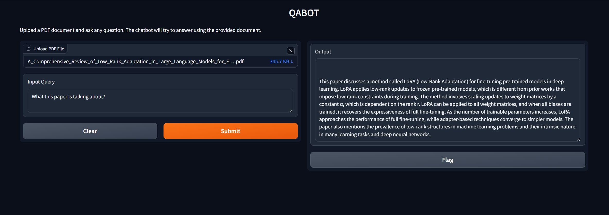

# QA-Bot

### Simple RAG QA Bot hosted on Gradio that takes a query and a PDF as input.

LLM and embedding model used watsonx.ai platform\
LLM used is granite 3.2-8b\
Embedding model used slate-125m-english

Gradio was used as a local web interface

LangChain was used for the loader, splitter, chroma vector database, and retriever.

List of packages that need to be installed:

    python3.11 -m pip install
    gradio==4.44.0
    ibm-watsonx-ai==1.1.2
    langchain==0.2.11
    langchain-community==0.2.10
    langchain-ibm==0.1.11
    chromadb==0.4.24
    pypdf==4.3.1
    pydantic==2.9.1
    huggingface_hub==0.23.0
    gradio
    huggingface_hub
